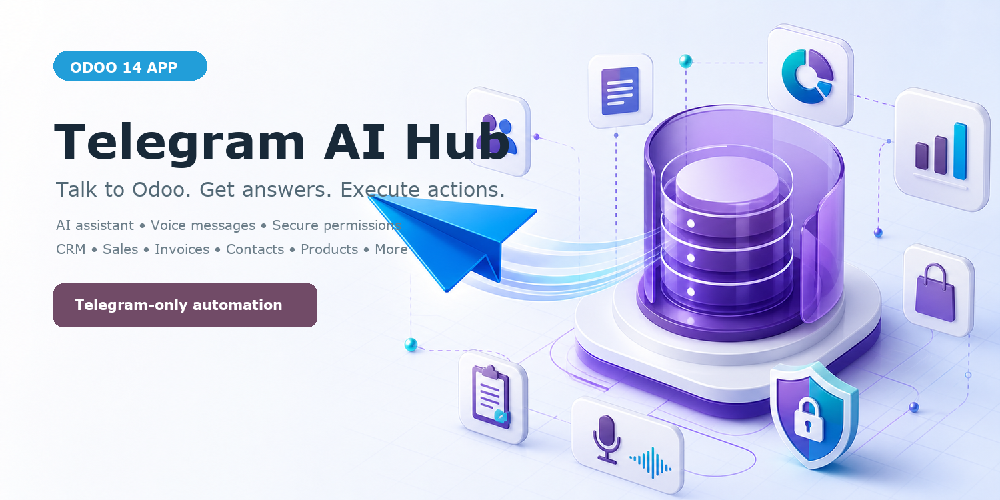

# Telegram AI Hub for Odoo 14

Telegram AI Hub turns Telegram into a secure AI assistant for Odoo. Authorized
employees can retrieve business information, send voice requests and execute
approved actions while Odoo access rules and explicit bot permissions remain
enforced.

## Main features

- guided BotFather, webhook and OpenAI setup;
- operations dashboard with activity, success rate and error monitoring;
- authorized Telegram employees linked to Odoo users;
- granular permissions for contacts, CRM, sales and accounting;
- natural-language and voice-message processing;
- invoice, payment, sales order, stock, CRM and calendar queries;
- controlled creation of contacts, leads and opportunities;
- configurable workflows, commands, keywords and AI steps;
- full conversation, message and event audit trail;
- transfer between the autonomous bot and human operators.

## Installation

Add this repository to the Odoo addons path, update the Apps list and install
`Telegram AI Hub`. The application module automatically installs its four
technical components.

## Configuration

Open **Telegram AI Hub → Configuration → Setup Assistant** and follow the
guided process. You will need:

1. a Telegram bot token created with BotFather;
2. a public HTTPS URL for the Telegram webhook;
3. an OpenAI API key supplied in the Odoo configuration;
4. the permanent numeric Telegram IDs of authorized employees.

## Demo video

[Download the English narrated Full HD demo](media/telegram_ai_hub_odoo19_demo_en.mp4)

English subtitles are available in
[`media/telegram_ai_hub_demo_en.srt`](media/telegram_ai_hub_demo_en.srt).

## Compatibility

- Odoo 14.0
- Community and Enterprise
- Telegram Bot API
- OpenAI API for AI responses and voice transcription

## External services

The application sends Telegram messages through the Telegram Bot API. When AI
features are enabled, the content required to answer a request or transcribe a
voice message is sent to the configured OpenAI API account. API credentials are
provided by the customer and stored in Odoo.

## License and support

License: OPL-1  
Author: ResilientByte Maroc  
Support: contact@kone-adama.com
